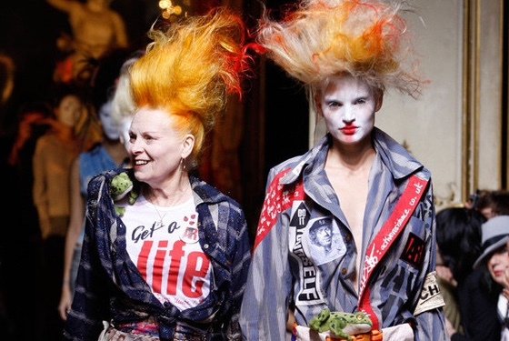
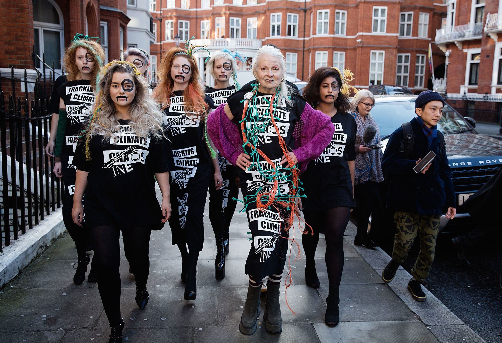

```{=html}
<div class="film-page">

  <!-- Hero -->
  <header class="hero">
    <div class="hero-rule"></div>
    <div class="hero-label">FILM REVIEW</div>
    <h1 class="hero-title">WESTWOOD</h1>
    <p class="hero-subtitle">Punk. Icon. Activist.</p>
    <div class="hero-rule"></div>
    <div class="hero-meta">
      <span>DIR. LORNA TUCKER</span>
      <span class="dot">&middot;</span>
      <span>DOCUMENTARY</span>
      <span class="dot">&middot;</span>
      <span>REVIEW BY KATHLEEN JUAREZ</span>
    </div>
  </header>

  <!-- Pull quote -->
  <section class="pull-quote-section">
    <blockquote class="pull-quote">
      &ldquo;When does someone cease to be a daring provocateur,<br>and become museum worthy?&rdquo;
    </blockquote>
  </section>
</div>
```
::: {layout-ncol="2"}
{fig-align="center" width="627"}

{fig-align="left" width="614"}
:::
```{=html}

  <!-- Body -->
  <article class="review-body">

    <p class="drop-cap">For those unfamiliar with Vivienne Westwood save for her moniker on a clothing label, the designer might strike you as a demure British dame within the first few minutes of director Lorna Tucker's <em>Westwood</em>. Lounging in a tufted chair next to an exquisite floral arrangement, Westwood seems sweet in grandmotherly way, if not eccentric.</p>

    <p>Fast-forward to a few minutes later into the documentary and <em>Westwood</em> leaves you with a very different impression of the designer. The night before her London Fashion Week show, she goes over the minutia of each piece, model, and accessory. Nothing escapes her notice and she berates an assistant for making an egregious error: a judgment call for a small hem on a garment where a large ribbed hem should be. "I don't remember doing this. Fuck them, they're just disgusting. What's with this tiny hem? It's crap," she says.</p>

    <div class="aside-quote">
      <div class="aside-rule"></div>
      <p>"I don't know what I'm doing, it's a mess. It's my fault, it's just not good."</p>
      <div class="aside-attribution">— Vivienne Westwood</div>
    </div>

    <p>Director Lorna Tucker's talent comes in the keen juxtaposition of the two sides of Westwood's demeanor. While the documentary is laden with incidences of Westwood's ferocity, it's contrasted with more intimate moments of Westwood at work. Camera panned at a distance, she confides in her husband post tiny-hem tirade, "I don't know what I'm doing, it's a mess. It's my fault, it's just not good." We can see where the weight of her work weighs heavily on her shoulders.</p>

    <p>Several times throughout the documentary, Westwood iterates a version of "If I don't like it, I just won't put it out." Though her desire for complete creative control leads her to be tyrannical at times, Westwood is revealed to be a deeply sensitive, and introspective artist who pours herself into every detail of her work.</p>

    <div class="divider">
      <span></span><span class="divider-glyph">&#10022;</span><span></span>
    </div>

    <p>Westwood's work is one of constant rebellion both against the status quo of stuffy English society and at certain points even her own previous designs. One portion of the documentary shows a museum curator from The Victoria and Albert Museum delicately handling Westwood's most famous piece: a muslin t-shirt adorned with a swastika and other subversive imagery. In another moment of brilliant juxtaposition, tinkling classical piano music plays as the curator runs her gloved hand over the inverted cross printed on the shirt.</p>

    <p>The emotional weight of the documentary relies on Westwood examining this question herself. Much of the documentary seems to be Westwood grappling with her name, company, and designs becoming globally known and marketable while still maintaining her artistic integrity as her company is on the verge of becoming a leviathan. "I'm in danger of not being able to control everything properly," she laments.</p>

    <div class="verdict-block">
      <div class="verdict-label">VERDICT</div>
      <p class="verdict-text">Perhaps most poignant about this documentary is the fact that despite having essentially built her career rebelling against the status quo, later Westwood is ironically resistant to change, evident in her fight against climate change and the uncontrollable growth of her own company.</p>
      <p class="verdict-text">Overall the film succeeds in taking Vivienne Westwood into the third dimension. The designer is a deeply complicated character and Lorna Tucker takes great care in exploring the intricacies of the designer's psyche over the course of the documentary. Through Tucker's lens, Westwood is more than just a label on a tag; she's a true artist willing to sacrifice monetary gain and fame to maintain her own creative vision.</p>
    </div>

  </article>

  <footer class="page-footer">
    <div class="footer-rule"></div>
    <p>Written by <strong>Kathleen Juarez</strong></p>
  </footer>

</div>
```
