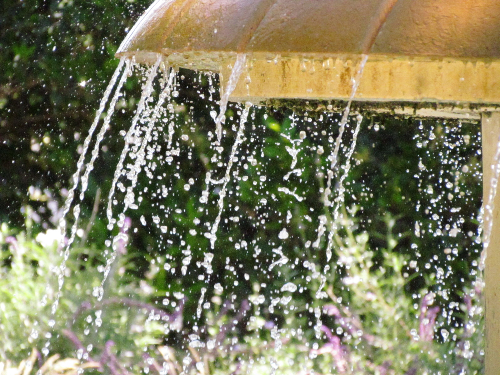

```{=html}
<div class="hero-wrapper">
  
  <div class="hero-overlay">
    <div class="hero-title">Welcome To My Portfolio</div>
    <div class="hero-subtitle">Your subheading goes here</div>
  </div>
</div>
```

# 

# 

```{=html}
<!-- Trigger Button -->
<button onclick="document.getElementById('siteModal').style.display='flex'" 
  style="background: #7e82ad; color: white; border: none; padding: 10px 20px; 
  border-radius: 20px; cursor: pointer; font-size: 1rem;">
  ✨ Behind the Scenes
</button>

<!-- Modal -->
<div id="siteModal" style="display:none; position:fixed; top:0; left:0; width:100%; 
  height:100%; background:rgba(0,0,0,0.5); z-index:9999; 
  justify-content:center; align-items:center;">
  
  <div style="background:white; border-radius:16px; padding:2rem; max-width:500px; 
    width:90%; position:relative; font-family:inherit;">
    
    <!-- Close Button -->
    <button onclick="document.getElementById('siteModal').style.display='none'"
      style="position:absolute; top:1rem; right:1rem; background:none; 
      border:none; font-size:1.5rem; cursor:pointer;">✕</button>

    <!-- Content -->
    <h2 style="color:hotpink; margin-top:0;">About This Site 🌸</h2>
    
    <p>This portfolio was hand-built by me — no templates, no drag-and-drop builders.</p>

    <h4 style="color:hotpink;">🛠 Tools I Used</h4>
    <ul>
      <li><strong>Quarto</strong> — for site structure and publishing</li>
      <li><strong>HTML & CSS</strong> — for custom styling and layout</li>
      <li><strong>R</strong> — for data visualizations and analytics work</li>
    </ul>

    <h4 style="color:hotpink;">💡 Why I Built It This Way</h4>
    <p>I wanted a space that felt like <em>me</em> — not a generic template. 
    Building it from scratch let me make every design decision intentionally, 
    the same way I approach marketing strategy.</p>

    <h4 style="color:hotpink;">📬 Want to connect?</h4>
    <p>Reach me at <a href="mailto:youremail@email.com" style="color:hotpink;">youremail@email.com</a></p>

  </div>
</div>

<!-- Close on backdrop click -->
<script>
  document.getElementById('siteModal').addEventListener('click', function(e) {
    if (e.target === this) this.style.display = 'none';
  });
</script>
```

# 

# 

# 

## Let's Connect

You can [email me](mailto:you@example.com) or connect on [LinkedIn](https://www.linkedin.com/in/your-profile).

*Welcome to my portfolio.*

------------------------------------------------------------------------
