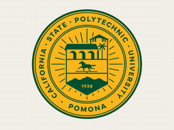

# Professional Summary

A digital marketer with a writer's instinct and an analyst's curiosity, using data to tell better stories and make smarter marketing decisions. 

My interests lie in digital marketing strategy, audience engagement, and campaign performance, understanding how people discover, interact with, and respond to digital content. What sets my approach apart is an analytical perspective: I enjoy using tools such as Google Analytics 4, Hubspot CRM, and R to explore customer behavior and uncover insights that help refine messaging, improve digital experiences, and guide smarter marketing decisions. 

My professional background spans communications, marketing, and event coordination, where I've managed multi-channel campaigns and projects from concept through execution — developing content, coordinating across teams, and tracking performance to measure what works. These experiences shaped my interest in the convergence of creative messaging, audience connection, and measurable outcomes. I'm drawn to the intersection where a well-told story meets a well-read dataset. That's where the most interesting marketing problems live and where I do my best work..

# Technical Skills

-   **Programming Languages:** R, Python, SQL, etc.\
-   **Web Technologies:** HTML, CSS/SCSS, JavaScript, Quarto, CMS Platforms, Analytics Tools

# Education

|   | Degree | Year | College / Department | Institution |
|--|------------------|------------------|------------------|------------------|
|  | Master of Science | 2024-2026 | Digital Marketing and Analytics | Cal Poly Pomona |
|  | Bachelor of Arts | 2013-2016 | English - Creative Writing | University of Southern California |

# Work Experience

### \[Job Title\], \[Company or Organization\]

*\[Start Date – End Date\]*

-   \[Responsibility or accomplishment #1\]\
-   \[Responsibility or accomplishment #2\]\
-   \[Responsibility or accomplishment #3\]\
-   \[Technical tools, collaboration, or outcomes\]\
-   \[Any metrics, impacts, or stakeholder involvement\]

------------------------------------------------------------------------

### \[Job Title\], \[Company or Organization\]

*\[Start Date – End Date\]*

-   \[Responsibility or accomplishment #1\]\
-   \[Responsibility or accomplishment #2\]\
-   \[Team leadership, training, or development\]\
-   \[Projects involving marketing, data, or web technologies\]\
-   \[Toolset used or strategies implemented\]

------------------------------------------------------------------------
