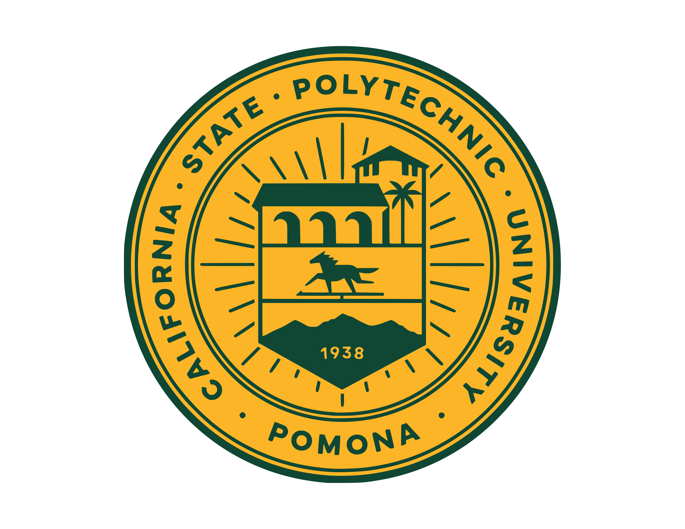

```{=html}
<style>
  body, .quarto-container, #quarto-content, .page-columns {
    max-width: 100% !important;
    width: 100% !important;
  }

  /* ── Skills 3×3 grid table ── */
  .skills-table {
    width: 100%;
    border-collapse: collapse;
    font-family: inherit;
    font-size: 0.92rem;
    box-shadow: 0 2px 14px rgba(0,0,0,0.09);
    border-radius: 10px;
    overflow: hidden;
    margin-top: 1rem;
    table-layout: fixed;
  }
  .skills-table th {
    background-color: #7aa496;
    color: #ffffff;
    text-align: left;
    padding: 13px 18px;
    font-size: 0.88rem;
    letter-spacing: 0.06em;
    text-transform: uppercase;
  }
  .skills-table td {
    padding: 12px 18px;
    vertical-align: top;
    border-bottom: 1px solid #e4e8ed;
    border-right: 1px solid #e4e8ed;
    width: 33.33%;
  }
  .skills-table td:last-child {
    border-right: none;
  }
  .skills-table tr:last-child td {
    border-bottom: none;
  }
  .skills-table tr:nth-child(even) {
    background-color: #f7f9fc;
  }
  .skills-table tr:hover {
    background-color: #eef2f7;
    transition: background-color 0.2s ease;
  }
  .cell-title {
    font-weight: 700;
    color: #7aa496;
    margin-bottom: 7px;
    font-size: 0.93rem;
  }
  .skill-item {
    padding: 2px 0;
    color: #444;
    line-height: 1.5;
  }
  .skill-item::before {
    content: "→ ";
    color: #7f8c8d;
  }
</style>
```

# Professional Summary

::: project-professional-summary
#### Digital marketer with a background in communications, content, and campaign execution. I bring an analytical edge to creative work to understand audience behavior and translate insights into stronger strategy. My best work lives where a compelling story meets a well-read dataset.
:::

# Skills

```{=html}
<table class="skills-table">
  <thead>
    <tr>
      <th>Digital Marketing &amp; Campaigns</th>
      <th>Content Creation &amp; Design</th>
      <th>Marketing Technology</th>
    </tr>
  </thead>
  <tbody>
    <tr>
      <td>
        <div class="skill-item">Multi-channel campaign planning, execution &amp; performance optimization</div>
        <div class="skill-item">Social media content, management &amp; digital storytelling</div>
        <div class="skill-item">Email marketing, automation &amp; brand messaging</div>
        <div class="skill-item">Database marketing &amp; audience segmentation</div>
      </td>
      <td>
        <div class="skill-item">Adobe Creative Suite (Photoshop, Illustrator, InDesign)</div>
        <div class="skill-item">Canva, CapCut (video editing)</div>
        <div class="skill-item">HTML/CSS fundamentals (website &amp; email editing)</div>
        <div class="skill-item">Writing — email, social media, web, newsletters, presentations, editorial, promotional, film &amp; TV scripts</div>
      </td>
      <td>
        <div class="skill-item">HubSpot CRM (segmentation, workflows &amp; automation)</div>
        <div class="skill-item">Google Analytics 4 (GA4)</div>
        <div class="skill-item">SEO/SEM — SEMrush, Moz</div>
        <div class="skill-item">Website CMS &amp; content management</div>
      </td>
    </tr>
    <tr>
      <th style="background-color:#7aa496; color:#fff; text-transform:uppercase; letter-spacing:0.06em; font-size:0.88rem; padding:13px 18px;">Analytics &amp; Reporting</th>
      <th style="background-color:#7aa496; color:#fff; text-transform:uppercase; letter-spacing:0.06em; font-size:0.88rem; padding:13px 18px;">Applied AI for Marketing</th>
      <th style="background-color:#7aa496; color:#fff; text-transform:uppercase; letter-spacing:0.06em; font-size:0.88rem; padding:13px 18px;"></th>
    </tr>
    <tr>
      <td>
        <div class="skill-item">Audience engagement metrics &amp; conversion analysis</div>
        <div class="skill-item">Marketing forecasting &amp; performance analysis</div>
        <div class="skill-item">R, SQL/BigQuery &amp; data visualization</div>
      </td>
      <td>
        <div class="skill-item">AI-assisted campaign optimization &amp; content development</div>
        <div class="skill-item">Predictive modeling for marketing performance</div>
        <div class="skill-item">AI-powered digital marketing workflows</div>
      </td>
      <td></td>
    </tr>
  </tbody>
</table>
```

# Education

|   | Institution | Degree | Year | College / Department |
|:-------------:|:-------------:|:-------------:|:-------------:|:-------------:|
| {width="140" height="110"} | Cal Poly Pomona, Singelyn Graduate School of Business | Master of Science | 2024-2026 | Digital Marketing and Analytics |
| {width="120"} | University of Southern California | Bachelor of Arts | 2013-2016 | English - Creative Writing |

# Work Experience

### Communications Coordinator and Property Assistant, The Ratkovich Company

*\[2019 – Present\]*

-   Designed and executed multi-channel campaigns across email, print, and digital platforms to drive community engagement and connection.
-   Built and managed audience segmentation strategies in HubSpot CRM, using engagement metrics to refine messaging, optimize timing, and improve communication effectiveness.
-   Produced branded content including newsletters, social media graphics, flyers, and event materials to support engagement initiatives and maintain consistent storytelling.
-   Collaborated cross-functionally with internal teams and stakeholders to align messaging, coordinate timelines, and support property-wide communications.

------------------------------------------------------------------------

### Editorial Intern, Flaunt Magazine

*\[2018\]*

-   Wrote and edited editorial content aligned with brand voice, increasing audience engagement and relevance.
-   Supported content production, event coordination, and stakeholder communication for brand activations and media initiatives.
-   Ensured brand consistency through fact-checking, proofreading, and adherence to editorial standards

### Summer Day Camp Director and Grant Writer, YMCA of West San Gabriel Valley

*\[2014 – 2017\]*

-   Directed internal communications and coordinated daily schedules for 200+ campers and a team of 20+ staff, ensuring consistent messaging and smooth operations.
-   Researched, budgeted, and wrote grants, and supported implementation once funds were received, contributing to program funding and sustainability.
-   Composed organizational documents and correspondence, supporting clear communication across staff, stakeholders, and leadership.
-   Led recruitment marketing efforts for seasonal staff, including crafting job postings and screening applicants.
-   Planned, scheduled, and executed field trips and daily events, balancing logistics, vendor coordination, and budget adherence.

# Certificates

## GA4 Certificate

## Data Certificates:


### Data Analytics with Google Cloud BigQuery and Looker Studio


### Introduction to BigQuery


### Introduction to SQL


### Intermediate SQL


### Data Wrangling and Visualization

```{=html}
<iframe src="https://badges.parchment.com/public/assertions/M9bOXtWwSS-nHuV9PJL18g?embedVersion=1&amp;embedWidth=370&amp;embedHeight=167&amp;utm_source=html_embed" title="Badge: Data Wrangling and Visualization" style="width: 370px; height: 167px; border: 0px;"></iframe>
```

## Deloitte Future of Work Institute

```{=html}
<div style="width: 100%; max-width: 600px;">
<div data-iframe-width="150" data-iframe-height="270" data-share-badge-id="8870a40d-cb85-4ed6-b114-0c58d213728c" data-share-badge-host="https://www.credly.com"></div><script type="text/javascript" async src="//cdn.credly.com/assets/utilities/embed.js"></script>
</div>
```
